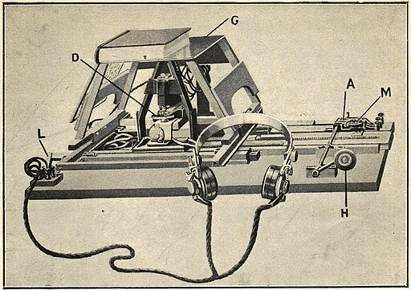
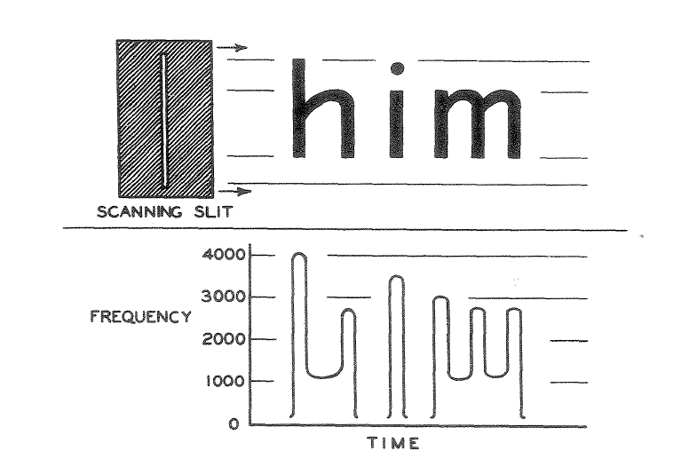

# LLM als OCR software

## Kurze Geschichte von OCR

| Jahr | Ereignisse |
|------|------------|
| __1870__ |  Erfindung Retina Scanner von Charles R. Carey |
| __1913__ | Erfindung von Optophone von Edmund Fournier d'Albe. Optophone ist ein Gerät, das die Schriftzeichen in Tönen verwandelt

 |
| __1931__ |  Patentierung von Statistical machine (Gerät zur fotooptischen Datenabfrage in der Mikrofilmtechnik) von Emanuel Goldberg ([US000001838389A](https://patents.google.com/patent/US1838389)) |
| __1951__ | Erfindung von [Gismo](https://patents.google.com/patent/US2663758A/en) (Patentierung 1953) von David Hammond Shepard. Gismo konnte gedruckte Schriftzeichen oder Morsecode in andere unterschiedliche Codierung umwandeln  |
| __1952__ | Shepard gründete die Firma "The Intelligent Machines Research Corporation" mit William Lawless Jr. und kommerzialisierte seine Erfindung |
| __1974__ | Ray Kurzweil erfand die erste "omni-font" OCR-Software |
| __1993__ | First release von ABBYY FineReader |
| __2005__ | "[Tesseract](https://github.com/tesseract-ocr/tesseract)" ist als Open Source Software freigegeben. Tesseract wurde urspürnglich von Hewlett-Packard zwischen 1984 und 1994 entwickelt |
| __2022__ | [Donut (Document Understanding Transformer)](https://github.com/clovaai/donut) ist bekannt gegeben. Donut ist ein "OCR-free end-to-end Transformer model", das doch Dokumente klassifizieren und Information aus Dokumente extrahieren kann |
| __2023/2024 ?__ | VLMs (Vision-Language-Modelle) werden auch als OCR eingesetzt[^1] |
| __2025 März__ | [MistralOCR](https://mistral.ai/news/mistral-ocr) released  |


[^1]: Lamm, Bianca, und Janis Keuper. „Can Visual Language Models Replace OCR-Based Visual Question Answering Pipelines in Production? A Case Study in Retail“. arXiv, 28. August 2024. (Preprint) https://doi.org/10.48550/arXiv.2408.15626.


## OCR Time Machine

[Daniel van Strien](https://danielvanstrien.xyz/) hat neulich "OCR Time Machine" auf der Plattform Huggingface publiziert:

https://huggingface.co/spaces/davanstrien/ocr-time-machine

__Beschreibung von OCR Time Machine__
>Travel through time to see how OCR technology has evolved!
>
>For decades, galleries, libraries, archives, and museums (GLAMs) have used Optical Character Recognition to transform digitized books, newspapers, and manuscripts into machine-readable text. Traditional OCR produces complex XML formats like ALTO, packed with layout details but difficult to use. Now, cutting-edge Vision-Language Models (VLMs) are revolutionizing OCR with simpler, cleaner Markdown output. This Space makes it easy to compare these two approaches and see which works best for your historical documents. Upload a historical document image and its XML file to compare these approaches side-by-side. We'll extract the reading order from your XML for an apples-to-apples comparison of the actual text content.

Wie Daniel beschreibt, funktioniert viele VLMs heute als gute OCR-Software.
Ausser solcher VLM-Modelle versuchen wir auch andere OCR-Software/Dienstleistungen, die traditionelle OCR-Verfahren haben.


## OCR-Funktionen testen

### OCR-Software, die wir heute ausprobieren

- Tesseract
- Google Cloud Vision API

__VLMs__

- MistralOCR
- GPT-4.1
- Gemini

## Qualitätsmessung 

Um die Qualität der OCR-Software/Dienstleistung sichtbar zu machen, wird CER (Character Error Rate) häufig verwendet. 

CER berechnet man folgendermassen:

CER (Character Error Rate) und WER (Word Error Rate)

__CER__

```math
(S + D + I) / N = (S + D + I) / (S + D + C)
````

- S ist die Anzahl der Ersetzungen
- D ist die Anzahl der Streichungen
- I ist die Anzahl der Einfügungen
- C ist die Anzahl der richtigen Zeichen
- N ist die Anzahl der Zeichen in der Referenz $`(N=S+D+C)`$

Bei Python gibt es verschiedene Libraries wie [jiwer](https://jitsi.github.io/jiwer/) oder [evaluate](https://github.com/huggingface/evaluate) für diesen Zweck.


__WER__

```math
(S + D + I) / N = (S + D + I) / (S + D + C)
````
- S ist die Anzahl der Ersetzungen
- D ist die Anzahl der Streichungen
- I ist die Anzahl der Einfügungen 
- C ist die Anzahl der richtigen Wörter 
- N ist die Anzahl der Wörter in der Referenz $`(N=S+D+C)`$

## Weiterführende Themen

### Weitere Modelle 


- [Text Titan I ter (Juli 2025/ Transkribus)](https://blog.transkribus.org/en/new-text-titan-i-ter-and-how-it-compares-to-chatgpt-gemini-and-other-llms)
- [Donut](https://github.com/clovaai/donut)
- [GOT-OCR2.0]()